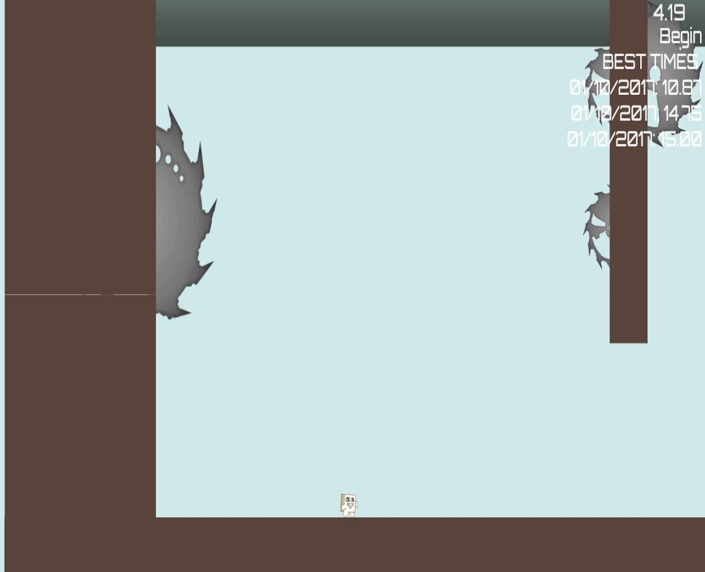
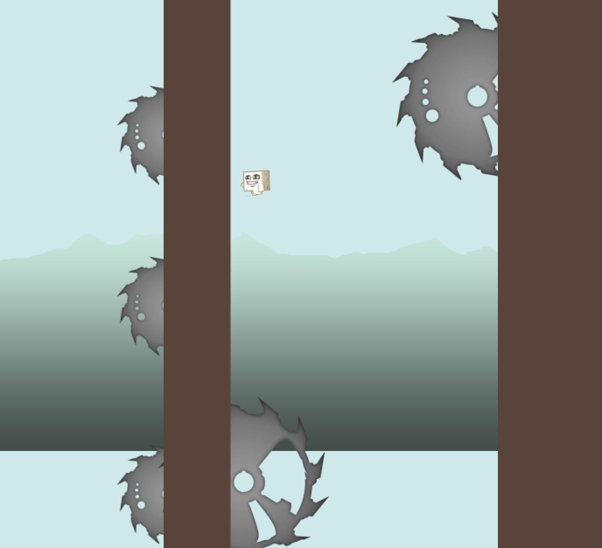
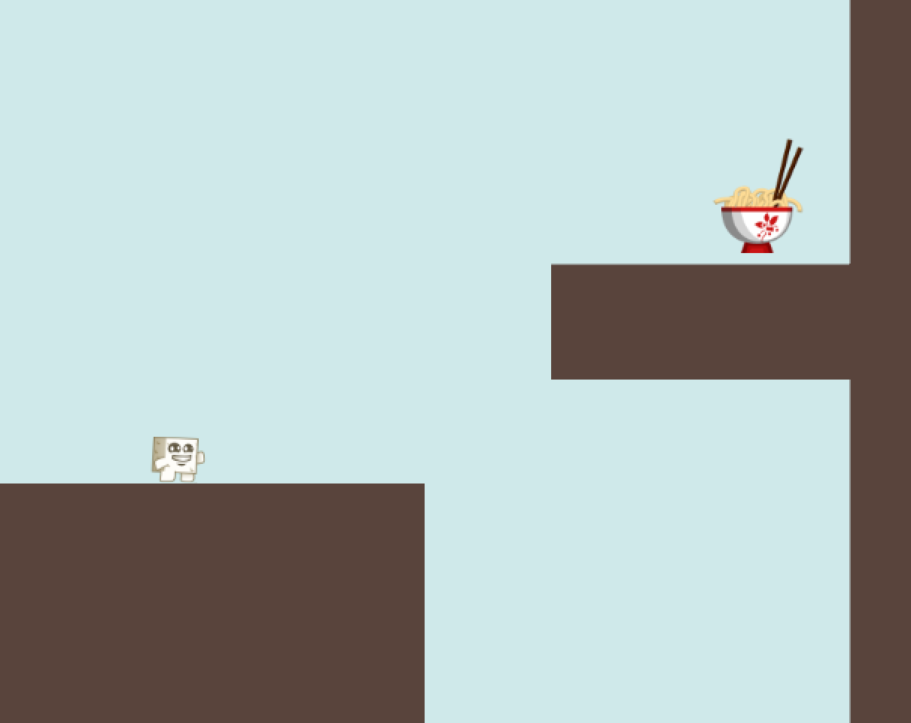

# Tofu-Adventure
* A 2D adventure game where the user-controls a tofu to achieve its goal of reaching the noodles by avoiding hazards
* Developed using C# in Unity, only partially following a tutorial
* Implemented additional game features, including a more complicated Scene, recording play times and best play times, expanded UI scene
* Planning to add new hazards, attack skills, saving ability and connecting multiple levels

